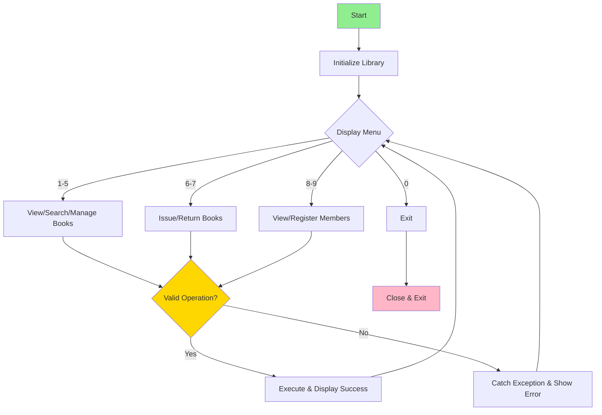

# 📚 Library Management System

> *"A book is a dream that you can hold in your hand."* — Neil Gaiman

---

## 🎯 Project Overview

A comprehensive Java application for managing library operations including book inventory, member registration, and book circulation. This project demonstrates OOP principles, Collections Framework, exception handling, and real-world system design through a menu-driven CLI interface.

---

## ✨ Key Features

- 📖 Add, remove, and view books with metadata
- 👥 Register and manage library members
- 🔄 Issue and return books with status tracking
- 🔍 Search by title (partial) or author (exact match)
- ⚠️ Custom exception handling for data integrity
- 🎨 Interactive menu-driven CLI interface

---

## 📁 Project Structure

```
Library Management System/
├── Book.java          # Book entity with metadata
├── Member.java        # Member entity and borrowing history
├── Library.java       # Core business logic (ArrayList + HashMap pattern)
├── LibraryException.java  # Custom exception class
└── Main.java          # CLI interface & menu system
```

---

## 🚀 Core Java Concepts Implemented

**1. Collections Framework:** Dual storage pattern using `ArrayList` (ordered iteration) + `HashMap` (O(1) lookups)

**2. Object-Oriented Programming:** Encapsulation, abstraction, and single responsibility principle across all classes

**3. Custom Exception Handling:** `LibraryException` for type-safe error management

**4. Enhanced For-Loops:** Clean iteration through collections

**5. String Manipulation:** Case-insensitive search and formatted output using `String.format()`

**6. Method Overriding:** Custom `toString()` implementation for readable object representation

**7. Switch-Case & Control Flow:** Modern arrow syntax (`->`) for menu selection

**8. Input/Output:** Scanner for user input and formatted console output

---

## 📊 System Architecture

### Workflow Diagram



---

## 💡 Quick Usage Example

**Scenario:** Alice registers and borrows "Clean Code"

```
1. Register Alice: Menu → 9 → Name: Alice Johnson → Email: alice@email.com
   ✓ Member registered with ID: 3

2. Issue Book: Menu → 6 → Book ID: 2 → Member ID: 3
   ✓ Book "Clean Code" issued to Alice Johnson
   (Book 2 status changes: Available → Issued)

3. Return Book: Menu → 7 → Book ID: 2 → Member ID: 3
   ✓ Book "Clean Code" returned by Alice Johnson
   (Book 2 status changes: Issued → Available)
```

---

## 🔧 Technical Highlights

**Dual Data Structure Pattern:**
```java
ArrayList<Book> bookList;  // Ordered iteration
HashMap<Integer, Book> bookMap;  // O(1) lookup
```

**Validation Before Operations:**
```java
if (bookMap.get(bookId) == null) throw new LibraryException("Not found");
if (bookMap.get(bookId).isIssued()) throw new LibraryException("Already issued");
// Perform operation...
```

---

## 🎮 How to Run

```bash
# Compile
javac *.java

# Run
java Main
```

## 📤 Sample Output

### Program Startup & Menu
```
╔══════════════════════════════╗
║   Library Management System  ║
╠══════════════════════════════╣
║  1. View all books           ║
║  2. Add a book               ║
║  3. Remove a book            ║
║  4. Search by title          ║
║  5. Search by author         ║
║  6. Issue a book             ║
║  7. Return a book            ║
║  8. View all members         ║
║  9. Register new member      ║
║  0. Exit                     ║
╚══════════════════════════════╝
Enter choice: 1

=== All Books ===
[ID: 1] The Alchemist by Paulo Coelho (Fiction) | Status: Available
[ID: 2] Clean Code by Robert Martin (Technology) | Status: Available
[ID: 3] Atomic Habits by James Clear (Self-Help) | Status: Available
[ID: 4] 1984 by George Orwell (Dystopian) | Status: Available
```

### Registering a New Member
```
Enter choice: 9
Name: Alice Johnson
Email: alice@email.com
Member registered: [ID: 3] Alice Johnson (alice@email.com) | Borrowed: []
```

### Issuing a Book
```
Enter choice: 6
Book ID: 2
Member ID: 3
Book "Clean Code" issued to Alice Johnson
```

### Viewing Books After Issue
```
Enter choice: 1

=== All Books ===
[ID: 1] The Alchemist by Paulo Coelho (Fiction) | Status: Available
[ID: 2] Clean Code by Robert Martin (Technology) | Status: Issued
[ID: 3] Atomic Habits by James Clear (Self-Help) | Status: Available
[ID: 4] 1984 by George Orwell (Dystopian) | Status: Available
```

### Viewing All Members
```
Enter choice: 8

=== All Members ===
[ID: 1] Aarav Shah (aarav@email.com) | Borrowed: []
[ID: 2] Priya Mehta (priya@email.com) | Borrowed: []
[ID: 3] Alice Johnson (alice@email.com) | Borrowed: [2]
```

### Searching by Author
```
Enter choice: 5
Author name: Robert Martin
Books by "Robert Martin":
  [ID: 2] Clean Code by Robert Martin (Technology) | Status: Issued
```

### Returning a Book
```
Enter choice: 7
Book ID: 2
Member ID: 3
Book "Clean Code" returned by Alice Johnson
```

### Error Handling Example
```
Enter choice: 6
Book ID: 99
Member ID: 1
Error: Book ID 99 not found.
```


---

## 🎓 Learning Outcomes

✅ OOP Design Principles (Encapsulation, SRP)  
✅ Collections Framework (ArrayList vs HashMap)  
✅ Custom Exception Handling  
✅ Menu-Driven CLI Design  
✅ Validation & State Management

---

## 🤓 Fun Java Facts

☕ **Java = Coffee:** Named after the island of Java, Indonesia's famous coffee producer!  
👦 **Duke Mascot:** Java's official mascot since 1994  
🥔 **WORA:** "Write Once, Run Anywhere" — works on Windows, Mac, Linux, or even potatoes with JVM!  
😂 **NullPointerException:** The most famous exception. Our `LibraryException` is way cooler! 🚀

---

## 💎 Future Enhancements

- 📅 Due date tracking & late fee calculation
- 🔐 Member authentication system
- 💾 Database persistence (SQL/MySQL)
- 📧 Email notifications
- 📱 GUI using Swing/JavaFX

## 🎊 Conclusion

This Library Management System is a professional showcase of Java fundamentals — demonstrating encapsulation, collections optimization, exception handling, and real-world design patterns. Perfect for learning core OOP concepts while building something practical!

**Remember:** Every great system starts with solid fundamentals and coffee ☕

---

